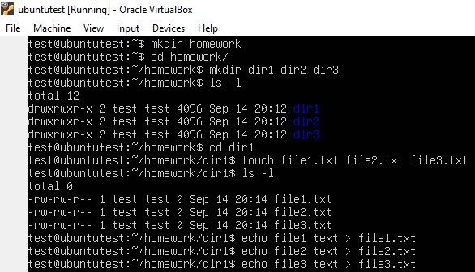
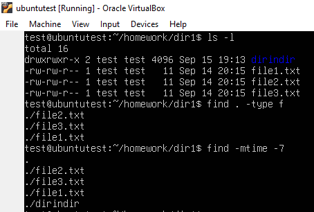

# Day 1 - Homework

### Part 2: Linux Directory and File Creation

This screenshot shows the creation of directories (homework, dir1, dir2, dir3) using the **mkdir** command,
and files (file1.txt, file2.txt, file3.txt) using the **touch** command.
The content was added to the files using the **echo** and **>** commands.

### Part 3: Using grep and find Commands

The **grep** command is used to search for the word "text" inside all .txt files.

This screenshot shows the use of the **find** command to locate all files in dir1. **-type f** is used to locate only files and not directories.
The second **find** command with **-mtime -7** shows files modified in the last 7 days.
